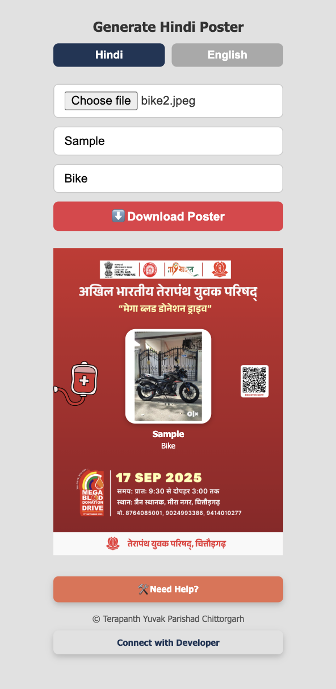

# 🖼️ Blood Donation Poster Generator

Blood Donation Poster Generator is a simple web application that allows users to create **personalized blood donation posters** with their **photo, name, and description**.  
The posters can be generated in **Hindi or English** and downloaded instantly for sharing on WhatsApp, social media, or for printing.

## ✨ Features

- 📤 **Photo Upload** – Add your picture to the poster.  
- ✍️ **Name & Description** – Personalize with your details.  
- 🌐 **Language Toggle** – Generate posters in **Hindi** or **English**.  
- 📥 **One-Click Download** – Save your customized poster as an image.  
- 🎨 **Pre-Designed Templates** – Event details already included, just personalize and download.  

---

## 📸 Screenshot

Here’s how the app looks in action:




---

## 🚀 Getting Started

### 1. Clone the Repository
```bash
git clone https://github.com/your-username/blood-donation-poster-generator.git
cd blood-donation-poster-generator
```

### 2. Run the Project
If it’s plain HTML/JS:
```bash
Open index.html in your browser
```

If it’s React or Node-based:
```bash
npm install
npm start
```

---

## 📂 File Structure
```
.
├── index.html        # Main UI
├── style.css         # Styling
├── script.js         # Poster generation logic
├── assets/           # Poster templates, logos, screenshot
├── README.md         # Documentation
```

---

## 📌 Usage

1. Open the app.  
2. Choose **Hindi** or **English**.  
3. Upload your **photo**.  
4. Enter your **name** and **description**.  
5. Click **Download Poster**.  

Your customized poster will be generated and saved to your device.  

---

## 🔧 Tech Stack
- **Frontend**: HTML, CSS, JavaScript  
- **Libraries**: Canvas API, html2canvas (optional for export)  

---

## 🤝 Contributing
Pull requests are welcome. You can add:  
- New poster templates  
- More language options  
- Improved download/export functionality  

---

## 📜 License
This project is licensed under the **MIT License** – free to use and modify.  

---